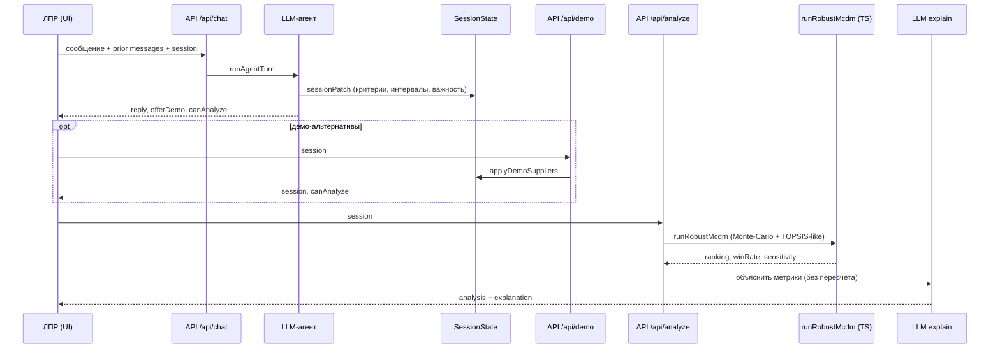

# Klar — интеллектуальная СППР (MVP)

Документ для научного руководителя. Описание архитектуры и соответствия теме ВКР; инструкция по запуску — в конце.

**Продукт:** Klar — мобильный веб-MVP системы поддержки принятия решений.  
**Тема ВКР (дословно):** «Разработка интеллектуальной системы поддержки принятия решений на основе LLM-агента и робастного многокритериального анализа».

| | |
|---|---|
| Репозиторий | https://github.com/hamletsspeak/opora-dss |
| Демо (Vercel) | https://opora-dss.vercel.app |

## 1. Постановка задачи

В прикладных выборах (поставщик, подрядчик, конфигурация) ЛПР часто формулирует предпочтения **нечёткими** выражениями: интервалы («цена примерно 450–500»), качественная важность («цена и срок важны, но насколько — не знаю»), частично заданные оценки альтернатив. Классический MCDM требует точечных весов и оценок; «сырой» LLM склонен подменять расчёт генерацией.

Klar разделяет роли:

| Компонент | Роль |
|-----------|------|
| LLM-агент | Диалог, извлечение структуры сессии, пояснение уже посчитанных метрик |
| Робастный MCDM (`runRobustMcdm`) | Детерминированное (при фиксированном seed) ранжирование в TypeScript **без** LLM |

Итог для ЛПР — не «мнение модели», а **частота победы** альтернатив при неопределённости весов/оценок плюс краткое текстовое объяснение цифр.

## 2. Архитектура потока данных

1. **UI (React/Vite)** — welcome / чат / результаты; same-origin `POST /api/chat|demo|analyze`.  
2. **LLM-агент** (`server/agent.ts`, `api/chat.ts`) — обновляет `SessionState` (контекст, критерии, альтернативы, пробелы).  
3. **Сессия** — JSON-контракт (`shared/types.ts`); демо-альтернативы — `POST /api/demo`.  
4. **Робастный MCDM** (`shared/mcdm.ts` ← `api/analyze.ts`) — `runRobustMcdm(session)` → ranking, `winRate`, чувствительность.  
5. **LLM-объяснение** — только по уже полученным метрикам (ранг не пересчитывает).



Локально те же маршруты обслуживает Express (`server/index.ts`); на Vercel — serverless `api/*.ts`.

## 3. Робастность в MVP

Реализация в `shared/mcdm.ts` (SMAA-lite / Monte-Carlo + TOPSIS-подобное расстояние до идеала):

1. **Выборки** — на каждой итерации семплируются веса (`weightUncertain` → priors по `importance`; точный вес фиксирован) и оценки (интервалы → семпл).  
2. **Ранг на выборке** — нормализация min/max, TOPSIS-like score → порядок альтернатив.  
3. **Агрегация** — `winRate` (доля выборок с 1-м местом), ожидаемый score / средний ранг; параллельно Weighted Sum и VIKOR на тех же выборках + `agreement`.  
4. **Чувствительность** — краткая оценка устойчивости лидера (primary = TOPSIS) к вариации весов.  
5. **Эксперимент** — фиксированный датасет и таблица `winRate`: `docs/experiment.md`.

LLM **не** семплирует и **не** задаёт итоговый порядок. Seed фиксируется для воспроизводимости.

## 4. Ключевые файлы

| Файл | Назначение |
|------|------------|
| `shared/mcdm.ts` | `runRobustMcdm` (TOPSIS + WSM + VIKOR); самотест `mcdm.selftest.ts` |
| `shared/audit.ts` | Audit payload + in-memory store; `api/audit.ts` |
| `shared/experiment.ts` | Фиксированный датасет эксперимента; `docs/experiment.md` |
| `python/mcdm/` | Порт ядра + `python/server.py` (`POST /analyze`) |
| `server/agent.ts` | Промпт, нормализация критериев, `runAgentTurn`, `explainResult` |
| `api/chat.ts` | Serverless-диалог; ключ только `process.env.OPENAI_API_KEY` |
| `api/analyze.ts` | MCDM + audit + опциональное LLM-пояснение |
| `shared/types.ts` | Контракт сессии / результата / agreement |
| `src/App.tsx` | UI Klar; в chat — **prior** history + текущее `message` |

## 5. Ограничения MVP

- Нет аккаунтов и долговременного хранения сессий.  
- Качество извлечения зависит от LLM (есть эвристический fallback).  
- Демо-альтернативы — учебный сценарий, не каталог поставщиков.  
- Нет полноценного PWA service worker.  
- Источник истины по рангу — метрики MCDM; текст LLM лишь поясняет их.

## 6. Соответствие теме ВКР

Тема требует **и** LLM-агента, **и** робастного многокритериального анализа. Агент работает с нечётким естественным языком и объясняет результат; робастный анализ выполнен отдельным детерминированным модулем с явными метриками устойчивости (`winRate` / чувствительность). Разделение устраняет подмену расчёта генерацией и делает ядро метода проверяемым вне модели.

---

## Приложение. Запуск и деплой

### Локально

```bash
git clone https://github.com/hamletsspeak/opora-dss.git
cd opora-dss
cp .env.example .env   # OPENAI_API_KEY=
npm install && npm run dev
```

- UI: http://localhost:5173 · API: http://localhost:8787 (`GET /api/health`)  
- Прод локально: `npm run build && npm start`  
- Самопроверка MCDM: `npm run test:mcdm`

| Переменная | Обязательно | Описание |
|---|---|---|
| `OPENAI_API_KEY` | да | Только сервер / Vercel env (**не** `VITE_*`) |
| `OPENAI_MODEL` | нет | По умолчанию `gpt-4o-mini` |
| `PORT` | нет | Express, по умолчанию `8787` |

### Vercel

Import репозитория → Framework Vite → Environment Variables: `OPENAI_API_KEY`, опц. `OPENAI_MODEL` → Deploy.  
Статика `dist` + serverless `api/*` на одном домене.

Дублирующая архитектурная копия: [`docs/architecture.md`](./docs/architecture.md) (канон для научрука — этот README).
