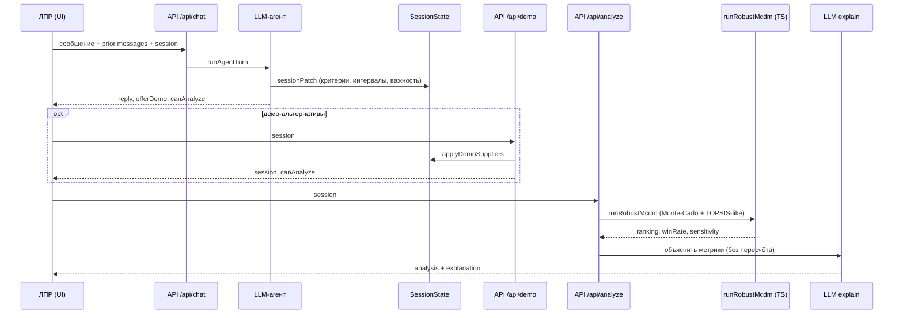

# Klar — архитектура MVP для научного руководителя

**Продукт:** Klar (мобильный веб-MVP системы поддержки принятия решений).  
**Тема ВКР (дословно):** «Разработка интеллектуальной системы поддержки принятия решений на основе LLM-агента и робастного многокритериального анализа».

**Репозиторий:** https://github.com/hamletsspeak/opora-dss  
**Демо:** https://opora-dss.vercel.app

## 1. Постановка задачи

В прикладных выборах (поставщик, подрядчик, конфигурация) ЛПР часто формулирует предпочтения **нечёткими** выражениями: интервалы («цена примерно 450–500»), качественная важность («цена и срок важны, но насколько — не знаю»), частично заданные оценки альтернатив. Классический MCDM требует точечных весов и оценок; «сырой» LLM склонен подменять расчёт генерацией.

Klar разделяет роли:

| Компонент | Роль |
|-----------|------|
| LLM-агент | Диалог, извлечение структуры сессии, пояснение уже посчитанных метрик |
| Робастный MCDM (`runRobustMcdm`) | Детерминированное (при фиксированном seed) ранжирование в TypeScript **без** LLM |

Итог для ЛПР — не «мнение модели», а **частота победы** альтернатив при неопределённости весов/оценок плюс краткое текстовое объяснение цифр.

## 2. Архитектура потока данных

1. **UI (React/Vite)** — экраны welcome / чат / результаты; запросы same-origin `POST /api/chat|demo|analyze`.  
2. **LLM-агент** (`server/agent.ts`, обёртка `api/chat.ts`) — обновляет `SessionState` (контекст, критерии, альтернативы, пробелы).  
3. **Сессия** — единый JSON-контракт (`shared/types.ts`); демо-поставщики — `POST /api/demo`.  
4. **Робастный MCDM** (`shared/mcdm.ts`, вызов из `api/analyze.ts`) — `runRobustMcdm(session)` → ranking, `winRate`, чувствительность.  
5. **LLM-объяснение** — только по уже полученным метрикам (не пересчитывает ранг).

Локально Express (`server/index.ts`) обслуживает те же маршруты; на Vercel — serverless `api/*.ts` (общий контракт).

## 3. Что означает «робастность» в MVP

Реализация в `shared/mcdm.ts` (SMAA-lite / Monte-Carlo + TOPSIS-подобное расстояние до идеала):

1. **Выборки.** На каждой итерации семплируются веса критериев (при `weightUncertain` — из priors по `importance`; при точном весе — фиксированно) и оценки альтернатив (интервалы → равномерный/согласованный семпл).  
2. **Ранг на выборке.** Нормализация min/max-критериев, TOPSIS-like score → порядок альтернатив.  
3. **Агрегация.** `winRate` — доля выборок, где альтернатива на 1-м месте; также ожидаемый score / средний ранг.  
4. **Чувствительность.** Краткая характеристика устойчивости лидера к вариации весов.

LLM **не участвует** в семплировании и не задаёт итоговый порядок. Seed фиксируется для воспроизводимости смоука.

## 4. Ключевые файлы

| Файл | Назначение |
|------|------------|
| `shared/mcdm.ts` | `runRobustMcdm`, готовность к анализу, самотест `mcdm.selftest.ts` |
| `server/agent.ts` | Системный промпт, нормализация критериев, `runAgentTurn`, `explainResult` |
| `api/chat.ts` | Serverless-вход диалога; ключ только `process.env.OPENAI_API_KEY` |
| `api/analyze.ts` | MCDM + опциональное LLM-пояснение |
| `shared/types.ts` | Контракт сессии / результата |
| `src/App.tsx` | UI Klar; в `/api/chat` уходит **prior** history + текущее `message` |

## 5. Ограничения MVP

- Нет учётных записей и долговременного хранения сессий.  
- Качество извлечения зависит от LLM; есть эвристический fallback.  
- Демо-альтернативы — учебный сценарий, не каталог поставщиков.  
- Нет полноценного PWA service worker.  
- Объяснение LLM может упрощать статистику; источником истины остаются метрики MCDM.

## 6. Соответствие теме ВКР

Тема требует **и** LLM-агента, **и** робастного многокритериального анализа. В Klar агент отвечает за работу с нечётким естественным языком и объяснение; робастный анализ реализован отдельно детерминированным модулем с явными метриками устойчивости (`winRate` / чувствительность). Такое разделение устраняет подмену расчёта генерацией и делает ядро метода проверяемым вне модели.
